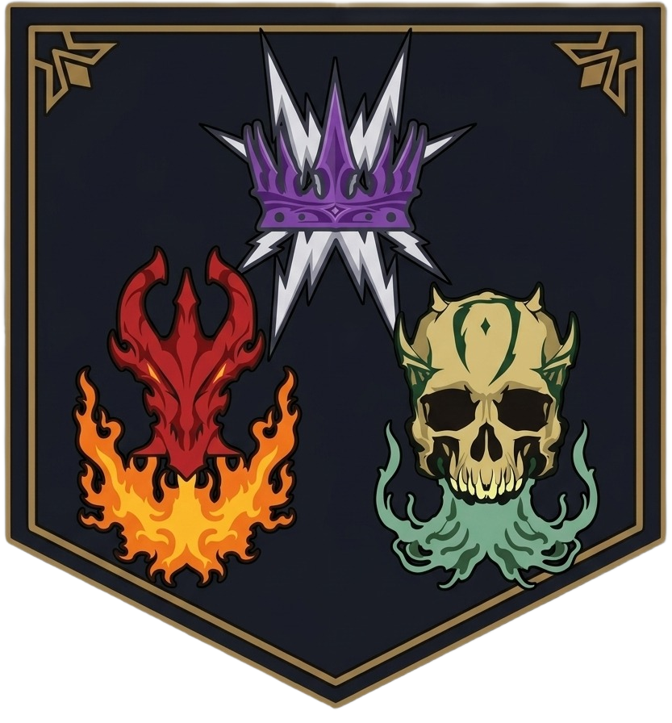
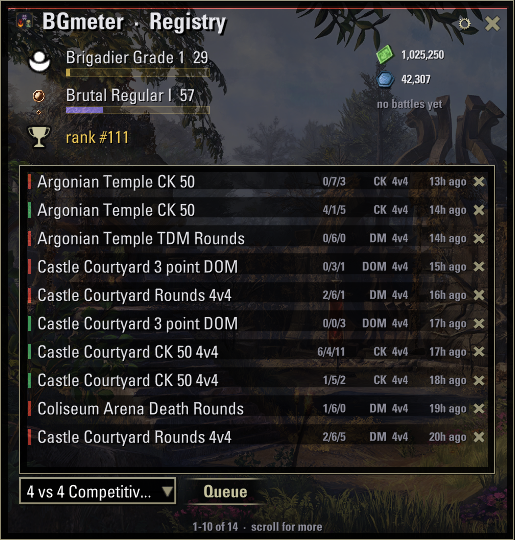
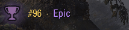
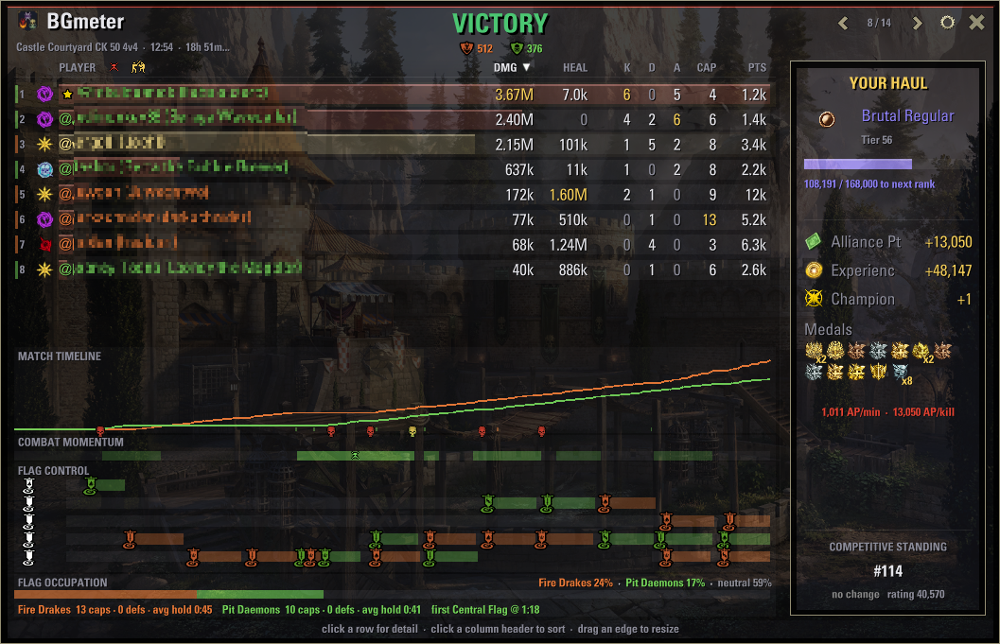
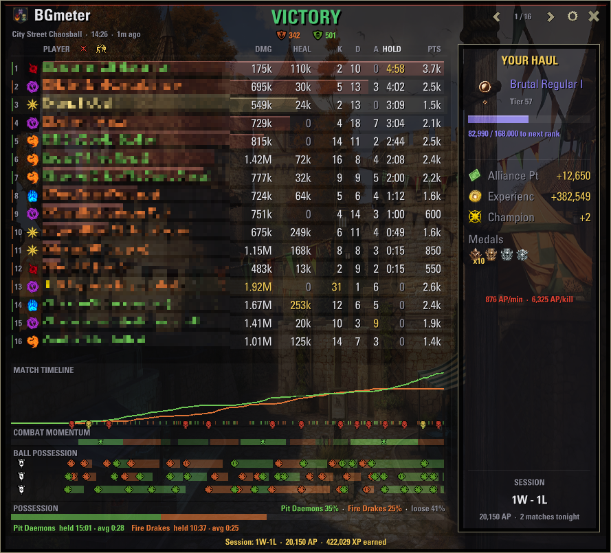

# BGmeter

_BGmeter is not created by, affiliated with, or sponsored by ZeniMax Media Inc. or its affiliates. The Elder Scrolls® and related logos are registered trademarks or trademarks of ZeniMax Media Inc. in the United States and/or other countries. All in-game imagery, icons and emblem designs shown or adapted in this repository (including the BGmeter logo, which is derived from in-game battleground team emblems) are the property of ZeniMax Media Inc., are used for non-commercial, informational purposes only, and no ownership over them is claimed._

  

**Battleground analytics for The Elder Scrolls Online.** BGmeter records every battleground you play and turns it into a report.

## The Registry

A browsable history of every recorded battle, and a warrior panel with relevant personal information.

  

Some aesthetic details around the leaderboards:

  

You can also queue for battlegrounds directly from the Registry (this does not aim to replace the original menu, it's just a convenience).

## The Battle Report

When a match ends (or when you open one from the Registry), you get the whole
story:

- **Full scoreboard**: damage, healing, K/D/A, captures, score and medals, sortable by any column, and more.
- **Match timeline**: team score over time, your kills and deaths marked,
  the bloodiest minute highlighted.
- **Combat momentum**: who was steamrolling whom, minute by minute.
- **Objective charts per mode**: flag control lanes for Domination and Crazy
  King, relic runs for Capture the Relic, carrier possession for Chaosball.
  Every current battleground mode is supported, including multi-round formats.
- **Your haul**: AP, XP and Champion Points earned, veterancy season-track progress, the medals you collected, and your
  competitive standing with movement since the last match.

  

  

## Install

- Download the zip from [ESOUI](https://www.esoui.com/) and extract it into `Documents/Elder Scrolls Online/live/AddOns/`.

## Use

| | |
|---|---|
| `/bgmeter` | Open / close the Battle Registry |
| Launcher icon | Draggable shield on your screen, click to open. (Yes, you can deactivate it) |
| Keybind | *Toggle BGmeter* under Controls → Keybindings |

Everything else lives in the UI: open a match from the Registry, use the gear
for settings.

## Good citizen

BGmeter is built to be invisible while you fight. I measured and profiled it myself several times: combat events are filtered
by the game engine itself (not in Lua), the per-sample data path allocates
zero memory, and nothing is written to chat. If you find a bug, a comment on
ESOUI reaches the author (me).

## License

[MIT](LICENSE). The license covers the addon code only: game artwork and derived designs remain the property of ZeniMax Media Inc.
